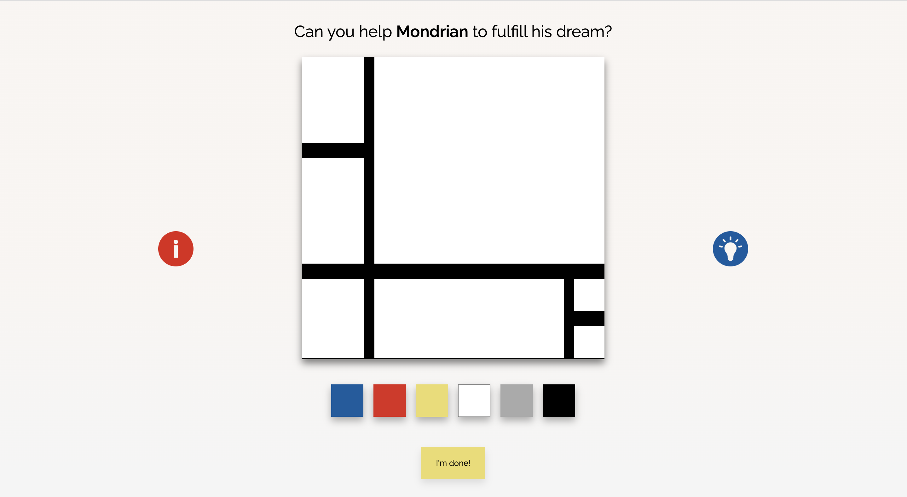

# Mondrian's Dream

## Description

This game was created with the objective of bringing the world of art closer to children, and what better way to do SO than through their favorite language? PLAY! Mondrian's Dream is conceived as a first step to help the little ones have a first contact with one of the mythical works of the Dutch artist, Piet Mondrian.
Through play, children will not only learn about Piet Mondrian's art but will develop their memory and concentration skills as well.

## User stories MVP

Minimum user stories:

- User can see a start screen with instructions and an end screen when he wins/ loses.
- User can see a drawing for 3 secs then it disappears.
- User can see the template of the drawing without the colors, just the grid.
- User can click on the square that he wants to paint and then on the colors.
- When user finishes user can click on a "finish" button that checks if the color pattern is correct.
- If color pattern is correct then user wins.
- If color pattern is incorrect user loses.

## User stories Backlog

- User can chose between 2 o more artworks to play.
- User can get hints.
- Responsive design (Media Queries).

## File structure

- <code>game.js</code>: contains all the elements for the game to work. Methods ans som DOM manipulation.
- <code>paintingAssets.js</code>: contains all the selectors (HTML elements).
- <code>sound.js</code>: contains click squares sound.
- <code>scripts.js</code>: contains all the DOM manipulation code to start the game and functions.

## Useful links

<!-- When you finish, add these links and commit -->

- [Mondrian's Dream Game Slides](https://slides.com/paulabertolinros/palette/fullscreen)
- [Mondrian's Dream Game](https://paubertolinros.github.io/mondrians-dream/)
